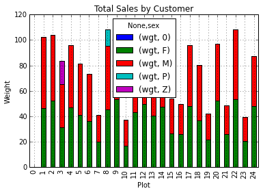

> ## Learning Objectives {.objectives}
>
> *   Explain what a library is, and what libraries are used for.
> *   Load a Python library and use the things it contains.
> *   Read tabular data from a file into a program.
> *   Assign values to variables.
> *   Select individual values and subsections from data.
> *   Perform operations on numeric data.
> *   Display simple graphs.

A library in Python contains a set of tools (called functions) that perform
tasks on our data. Importing a library is like getting a piece of lab equipment
out of a storage locker and setting it up on the bench for use in a project.
Once a library is set up, it can be used or called to perform many tasks.

([Mythbusters workshop](http://www.popularmechanics.co.za/wp-content/uploads/resized/92470_resized_image3.jpg))

One of the best options for working with tabular data in python is to use the
[Python Data Analysis Library](http://pandas.pydata.org/) (a.k.a. pandas). The
Pandas library provides data structures, produces high quality plots with
[matplotlib](http://matplotlib.org/) and integrates nicely with other libraries
that use [NumPy](http://www.numpy.org/) (which is another Python library) arrays.

Python doesn't load all of the libraries available to it by default. We have to
add an `import` statement to our code in order to use library functions. To import
a library, we use the syntax `import libraryName`. If we want to give the
library a nickname to shorten the command, we can add `as nickNameHere`.  An
example of importing the pandas library using the common nickname `pd` is below.

~~~{.python}
import pandas as pd
~~~

Each time we call a function that's in a library, we use the syntax
`LibraryName.FunctionName`. Adding the library name with a `.` before the
function name tells python where to find the function. In the example above, we
have imported pandas as `pd`. This means we don't have to type out `pandas` each
time we call a pandas function.

> ## Lesson Overview {.callout}
> We are studying the species and weight of animals caught in plots in a study
> area. The data sets are stored in .csv (comma separated value) format. Within
> the `.csv` files, each row holds information for a single animal, and the
> columns represent: record_id, month, day, year, plot, species, sex, wgt.
> 
> The first few rows of our first file look like this:
> 
> ~~~{.python}
> "record_id","month","day","year", "plot","species","sex","wgt"
> "63","8","19","1977","3","DM","M","40"
> "64","8","19","1977","7","DM","M","48"
> "65","8","19","1977","4","DM","F","29"
> "66","8","19","1977","4","DM","F","46"
> "67","8","19","1977","7","DM","M","36"
> ~~~
> 
> ### We want to:
> 1. Load the data into memory in Python.
> 2. Calculate the average weight of all individuals sampled, by species.
> 3. Plot the average weights by species and perhaps by plot too.
> 
> We can automate this process using Python. It's efficient to spend time
> building the code to perform these tasks because once it's built, we can use it
> over and over on different datasets that use a similar format. This makes our
> methods easily reproducible. We can also easily share our code with colleagues
> and they can replicate the same analysis.

## Reading Data using pandas
We will begin by locating and reading our survey data which are in CSV format.
We can use Pandas `read_csv` function to pull the file directly into a
[DataFrame](http://pandas.pydata.org/pandas-docs/stable/dsintro.html#dataframe).

> ## So what's a DataFrame? {.callout}
> A DataFrame is a 2-dimensional data structure that can store data of different
> types (including characters, integers, floating point values, factors and more)
> in columns. It is similar to spreadsheets or SQL tables or the `data.frame` in
> R.

First, let's make sure the python Pandas library is loaded. We will import
Pandas using the nickname `pd`.

~~~{.python}
import pandas as pd
~~~

Let's also import the [OS Library](https://docs.python.org/2/library/os.html). This library allows us to make sure we are
in the correct working directory. If you are working in
IPython Notebook, be sure to start the notebook in the workshop repository.
If you didn't do that you can always set the working directory using the code
below.

~~~{.python}
import os
os.getcwd()
# if this directory isn't right, use the command below to set the working directory
os.chdir("YOURPathHere")
~~~

~~~{.python}
# note the pd.read_csv is used because we imported pandas as pd
pd.read_csv("data/surveys.csv")
~~~

The above command yields:

~~~{.output}
record_id  month  day  year  plot species  sex  wgt
01      7   16  1977     2     NaN    M  NaN
12      7   16  1977     3     NaN    M  NaN
23      7   16  1977     2      DM    F  NaN
34      7   16  1977     7      DM    M  NaN
45      7   16  1977     3      DM    M  NaN
56      7   16  1977     1      PF    M  NaN
67      7   16  1977     2      PE    F  NaN
78      7   16  1977     1      DM    M  NaN
89      7   16  1977     1      DM    F  NaN
9      10      7   16  1977     6      PF    F  NaN
10     11      7   16  1977     5      DS    F  NaN
11     12      7   16  1977     7      DM    M  NaN
12     13      7   16  1977     3      DM    M  NaN
13     14      7   16  1977     8      DM  NaN  NaN
...
[35549 rows x 8 columns]
~~~

We can see that there were 33,549 rows parsed. Each row has 8 
columns. It looks like  the `read_csv` function in Pandas read our file
properly. However, we haven't saved any data to memory so we can work with it.
We need to assign the DataFrame to a variable. A variable is a
name for a value, such as `x` or `data`. Python's variables must begin with a letter and are [case sensitive](reference.html#case-sensitive). We can create a new object with a
variable name by assigning a value to it using `=`.

> ## Variables 101 {.callout}
> Let's step back and instead of considering a table of data,
> consider the simplest "collection" of data,
> a single value.
> The line below assigns the value `55` to a variable `weight_kg`:
>
> ~~~{.python}
> weight_kg = 55
> ~~~
>
> Once a variable has a value, we can print it to the screen:
>
> ~~~{.python}
> print weight_kg
> ~~~
> ~~~ {.output}
> 55
> ~~~
>
> and do arithmetic with it:
>
> ~~~{.python}
> print 'weight in pounds:', 2.2 * weight_kg
> ~~~
> 
> ~~~ {.output}
> weight in pounds: 121.0
> ~~~
>
> We can also change a variable's value by assigning it a new one:
>
> ~~~{.python}
> weight_kg = 57.5
> print 'weight in kilograms is now:', weight_kg
> ~~~
> 
> ~~~ {.output}
> weight in kilograms is now: 57.5
> ~~~
>
> As the example above shows,
> we can print several things at once by separating them with commas.
>
> If we imagine the variable as a sticky note with a name written on it,
> assignment is like putting the sticky note on a particular value:
>
> 
>
> This means that assigning a value to one variable does *not* change the values of other variables.
> For example,
> let's store the subject's weight in pounds in a variable:
>
> ~~~{.python}
> weight_lb = 2.2 * weight_kg
> print 'weight in kilograms:', weight_kg, 'and in pounds:', weight_lb
> ~~~
> 
> ~~~ {.output}
> weight in kilograms: 57.5 and in pounds: 126.5
> ~~~
>
> 
>
> and then change `weight_kg`:
>
> ~~~{.python}
> weight_kg = 100.0
> print 'weight in kilograms is now:', weight_kg, 'and weight in pounds is still:', weight_lb
> ~~~
> ~~~ {.output}
> weight in kilograms is now: 100.0 and weight in pounds is still: 126.5
> ~~~
>
> 
>
> Since `weight_lb` doesn't "remember" where its value came from,
> it isn't automatically updated when `weight_kg` changes.
> This is different from the way spreadsheets work.

Just as we can assign a single value to a variable, we can also assign an array of values
to a variable using the same syntax.  Let's call the imported survey data `surveys_df`:

~~~{.python}
surveys_df = pd.read_csv("data/surveys.csv")
~~~

Notice when you assign the imported dataframe to a variable, python does not
produce any output on the screen. We can print the value of the `surveys_df`
object by typing its name into the python command prompt.

~~~{.python}
surveys_df
~~~

~~~{.output}
record_id  month  day  year  plot species  sex  wgt
01      7   16  1977     2     NaN    M  NaN
12      7   16  1977     3     NaN    M  NaN
23      7   16  1977     2      DM    F  NaN
34      7   16  1977     7      DM    M  NaN
45      7   16  1977     3      DM    M  NaN
56      7   16  1977     1      PF    M  NaN
67      7   16  1977     2      PE    F  NaN
78      7   16  1977     1      DM    M  NaN
89      7   16  1977     1      DM    F  NaN
9      10      7   16  1977     6      PF    F  NaN
10     11      7   16  1977     5      DS    F  NaN
11     12      7   16  1977     7      DM    M  NaN
12     13      7   16  1977     3      DM    M  NaN
13     14      7   16  1977     8      DM  NaN  NaN
...
[35549 rows x 8 columns]
~~~

Now that our data is in memory,
we can start doing things with it.
First,
let's ask what [type](reference.html#type) of thing `surveys_df` refers to:

~~~python
type(surveys_df)
# this does the same thing as the above!
surveys_df.__class__
~~~

The `type` method and
`__class__` attribute tell us that `surveys_df` is `<class
'pandas.core.frame.DataFrame'>`. We can also use the `surveys_df.dtypes` command to view the data type for each
column in our dataframe. Int64 represents numeric integer values - int64 cells
can not store decimals. Object represents strings (letters and numbers). Float64
represents numbers with decimals.

~~~{.python}
surveys_df.dtypes
~~~

~~~{.output}
record_id      int64
month   int64
day     int64
year    int64
plot    int64
speciesobject
sex    object
wgt   float64
dtype: object
~~~

We'll talk a bit more about what the different formats mean in a different lesson.

> ### How to view DataFrame objects in Python {.callout}
> There are multiple methods that can be used to summarize and access the data
> stored in dataframes. Note that we call the method by using
> the object name `surveys_df.method`. So `surveys_df.columns` provides an index
> of all of the column names in our DataFrame.

> ## Exploring methods {.challenge}
> 1. `surveys_df.columns`
> 2. `surveys_df.head()` Also, what does `surveys_df.head(15)` do?
> 3. `surveys_df.tail()`
> 4. `surveys_df.shape` Take note of the output of the shape method. In what format does it return the shape of the DataFrame?
> HINT: [More on tuples here](https://docs.python.org/2/tutorial/datastructures.html#tuples-and-sequences).

## Calculating statistics in a pandas DataFrame

We've read our data into Python. Now, let's perform some quick summary
statistics to learn more about the data that we're working with. We might want
to know how many animals were collected in each plot, or how many of each
species were caught. We can perform summary stats quickly using groups. But
first we need to figure out what we want to group by.

Let's begin by exploring our data:

~~~python
# Look at the column names
surveys_df.columns.values
~~~

~~~{.output}
array(['record_id', 'month', 'day', 'year', 'plot', 'species', 'sex', 'wgt'], dtype=object)
~~~

We can also get a list of all the unique species. The `pd.unique` function tells us all of
the unique values in the species column.

~~~python
pd.unique(surveys_df.species_id)
~~~

~~~{.output}
array(['NL', 'DM', 'PF', 'PE', 'DS', 'PP', 'SH', 'OT', 'DO', 'OX', 'SS',
'OL', 'RM', nan, 'SA', 'PM', 'AH', 'DX', 'AB', 'CB', 'CM', 'CQ',
'RF', 'PC', 'PG', 'PH', 'PU', 'CV', 'UR', 'UP', 'ZL', 'UL', 'CS',
'SC', 'BA', 'SF', 'RO', 'AS', 'SO', 'PI', 'ST', 'CU', 'SU', 'RX',
'PB', 'PL', 'PX', 'CT', 'US'], dtype=object)
~~~

> ## Examine the data {.challenge}
> 1. Create a list of unique plot ID's found in the surveys data. Call it
> `plotNames`. How many unique plots are there in the data? How many unique
>    species are in the data?

## Groups in Pandas

We might often be interested in calculating summary statistics grouped by subsets or attributes
within fields of our data. For example, we might want to calculate the average
weight of all individuals per plot.

We can also extract basic statistics for all rows in a column, individually
using the syntax below:

~~~python
surveys_df['wgt'].describe()
~~~

~~~{.output}
count    32283.000000
mean 42.672428
std  36.631259
min   4.000000
25%  20.000000
50%  37.000000
75%  48.000000
max 280.000000
dtype: float64
~~~

We can also calculate each specific metric separately:

~~~python
surveys_df['wgt'].min()
surveys_df['wgt'].max()
surveys_df['wgt'].mean()
surveys_df['wgt'].std()
surveys_df['wgt'].count()
~~~

But if we want to summarize by one or more variables (for example,  sex), we
use the `.groupby` method in pandas. Once we've created a groupby DataFrame, we
can quickly calculate summary statistics by a group of our choice.

~~~python
# Group data by sex
sorted = surveys_df.groupby('sex')
~~~

The pandas method `describe` will return descriptive stats for each column that contains numeric data.

~~~python
# summary statistics for all numeric columns by sex
sorted.describe()
# provide the mean for each numeric column by sex
sorted.mean()
~~~

~~~{.output}
 record_id day  yearplot wgt
sex
F    18036.412046  16.007138  1990.644997  11.440854  42.170555
M    17754.835601  16.184286  1990.480401  11.098282  42.995379
P    22488.000000  21.000000  1995.000000   8.000000  13.000000
R    21704.000000  12.000000  1994.000000  12.000000 NaN
Z    23839.000000  15.000000  1996.000000   3.000000  18.000000

~~~

The `groupby` command is powerful in that it allows us to quickly generate
summary stats. This is also useful for initial examination of our data. We can
immediately notice some unusual values in our data that we might need to explore
further. For example, unless we're working with butterflies, Z is unlikely to be a sex. Also,
it looks like there are no weight values for the species that is of sex "R".

> ## Test your understanding {.challenge}
> 1. How many records contain the sex designations "Z", "P" and "R"?
> 2. What happens when you run:
> `sorted2 = surveys_df.groupby(['plot','sex'])`
> `sorted2.mean()`
> 3. Summarize weight values for each plot in your data. HINT: you can use the
>    following syntax to create summary statistics for any one column in your data.
>    `byPlot['wgt'].describe()`

## Quickly Creating Summary Counts in Pandas

Let's count the samples of each unique species that appear in our data. We can do this in a few
ways. We'll use `groupby` combined with a `count()` method.

~~~python
# count the number of samples by species
species_list = surveys_df['record_id'].groupby(surveys_df.species).count()
~~~

If we just want to know about the species "DO", we can type:

~~~python
surveys_df['record_id'].groupby(surveys_df.species).count()['DO']
~~~

## Basic Math Functions

We might be interested in performing a calculation on an entire column of our data. For
example, we might need to convert between units or normalize the data according to a mean or the area.

~~~{.python}
# convert the weight from grams to kilograms
surveys_df['wgt']*0.0001
~~~

## Quick & Easy Plotting in pandas

> ## Some IPython magic {.callout}
>
> If you're using an IPython / Jupyter notebook,
> you'll need to execute the following command
> in order for your matplotlib images to appear
> within the notebook (instead of a window):
>
> ~~~{.python}
> % matplotlib inline
> ~~~
>  
> The `%` indicates an IPython magic function, which are
> functions that are only valid within the notebook environment.
> Note that you only have to execute this function once per notebook.

We can also plot our summary stats with pandas:

~~~{.python}
# create a quick bar chart
species_list.plot(kind='bar');
~~~

We can also look at how many animals were captured in each plot:

~~~python
total_count=surveys_df.record_id.groupby(surveys_df['plot']).nunique()
# let's plot that too
total_count.plot(kind='bar');
~~~

> ## Make some figures {.challenge}
> 1. Create a plot of average weight across all species per plot.
> 2. Create a plot of total males versus total females for the entire dataset.

> # Summarize the data {.challenge}
> Create a stacked bar plot, with weight on the Y axis, and the stacked variables
> being sex. The plot should show total weight by sex for each plot. Some 
> tips are below to help you solve this challenge [Go here to learn more about pandas plots](http://pandas.pydata.org/pandas-docs/dev/generated/pandas.core.groupby.DataFrameGroupBy.plot.html).
>
> * You can use the code that follows to create a stacked bar plot but the data
>   need to be in individual where each value is a mean weight.
>   The first column represents the plot number and the second and third columns
>   represent the sex, like this:
>
> ~~~{.python}
>         wgt
> sex     F   M
> plot
> 1  46.311138 55.950560
> 2  52.561845 51.391382
>
> my_plot=data.plot(kind='bar',stacked=True,title="Total Weight by Plot and Sex")
> my_plot.set_xlabel("Plot")
> my_plot.set_ylabel("Weight")
> ~~~
>
> * You can use the `.unstack()` method to transform grouped data into columns for
>   each plotting. Try running `surveys_df.unstack' and see what it yields.
>
> 

